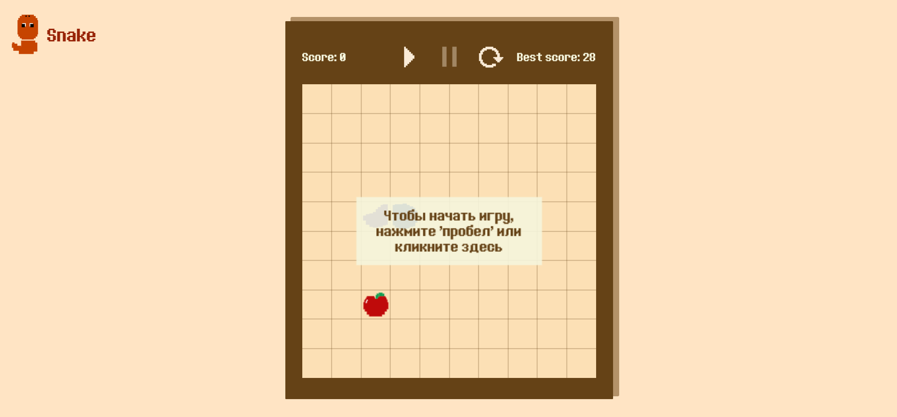
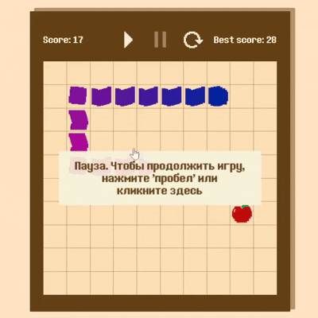

# 🐍 Snake Game

A classic Snake game built with vanilla JavaScript and the Canvas API.  
This is a study project created to practice working with game states, event handling, canvas rendering, and asset loading.

## 🎮 Demo

[Live demo](https://natishark.github.io/p1-snake/)

## 📸 Screenshots

    
  

## ✨ Features

- Start, pause, fail and win screens with prompts (e.g., "Press SPACE or click the field to play")
- Resume via SPACE or click on the field
- Score tracking (current and the best score saved in `localStorage`)
- Arrow keys (or WASD) to control the snake
- Collision detection
- Win condition: snake fills the entire field
- Custom styled UI with gradient snake body, images for head/body/apple, and the page logo
- Responsive control panel with score, control buttons, and best score
- P.S. The snake's movement is discrete.

## 🛠 Technologies

- HTML5 & CSS3
- Vanilla JavaScript (ES6+)
- Canvas API
- LocalStorage

## 🚀 How to run locally

> **Note:** Due to browser security policies (CORS), the project **will not work** by simply opening `index.html` from the file system. You need to serve it with a local development server.

Here are a few simple ways to do that:

### Option 1: VS Code with Live Server
1. Install the [Live Server](https://marketplace.visualstudio.com/items?itemName=ritwickdey.LiveServer) extension.
2. Open the project folder in VS Code.
3. Right-click `index.html` and select **"Open with Live Server"**.

### Option 2: Python 3
```bash
# In the project folder, run:
python3 -m http.server
# Then open http://localhost:8000 in your browser
```

### Option 3: Node.js (with http-server)
```bash
# Install globally (once)
npm install -g http-server
# Then in the project folder:
http-server
# Open http://localhost:8080
```

### Option 4: Any other static server
You can use any tool that serves static files (e.g., serve, live-server, etc.).

Once the server is running, open the provided URL (usually http://localhost:8000 or similar) in your browser to play the game.

## 🔍 Technical Highlights & Key Decisions

- Game state management (primitive, no libs) – I used a simple finite state machine using two variables: `gameState` and `gameResult`. Each state controls what is rendered and which user inputs are accepted.

- Direction change & fast input – I prevented the snake from reversing into itself by ignoring few direction changes occured on one animation tick, would've caused immediate collision.

- Asset loading, animated – Loading of custom image (apple.svg) and a custom font asynchronously. The game waits for all assets to load using simple loading animation on Canvas before drawing the start screen.

- Apple placement – The random positions for the apple is countedso that it's not on the snake's body on the first try (no assumptions about probability, feels calmer this way).

- Visual polish – the control buttons are styled as icons. Added a semi-transparent overlay behind on-screen messages to improve readability. Adaptive layout (for PC mostly)

## 📚 Lessons Learned

While building this project, I improved my understanding of:
- Canvas drawing: shapes, text, images, and working with fonts.
- Managing game states and transitions.
- Keyboard and mouse event handling.
- Using `requestAnimationFrame` for the game loop and controlling its execution.
- Persisting data with `localStorage`.
- Asynchronous loading of fonts and images with `Promise`'s.
- Debugging.

## 🔮 Future Improvements

- Change field size, color themes via settings.
- Difficulty levels (speed changes).
- Smooth movement instead of discrete.
- Sound effects and improved visuals.
- Mobile support (swipe, layout).